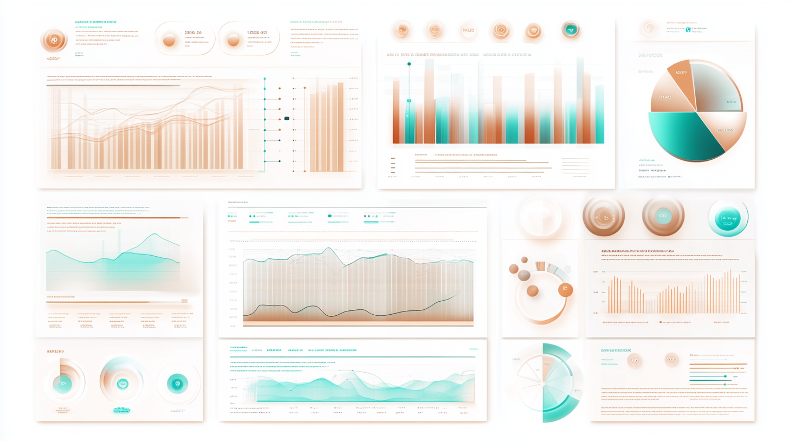

Our services are designed to meet the unique needs of non-profit organizations. We provide innovative technology solutions that streamline operations, enhance data understanding, and engage your audience effectively.

## Custom Internal Applications

We develop bespoke software solutions that optimize your internal processes, saving you time and resources.

- **Features:**
  - Tailored to your specific workflows
  - Secure and scalable platforms
  - Integration with existing systems

*Alt text: Illustration of a non-profit team efficiently managing operations using custom software tools.*

## AI-Powered Visualizations

Leverage artificial intelligence to turn complex data into clear, actionable insights.

- **Features:**
  - Interactive dashboards
  - Predictive analytics
  - Data-driven decision support

*Alt text: Visual representation of data analytics with AI, showing charts and graphs in a user-friendly interface.*

## Public Engagement Tools

Enhance your outreach with interactive tools that engage donors, volunteers, and the community.

- **Features:**
  - Custom web tools for campaigns
  - Interactive maps and visual content
  - Online forms and surveys

*Alt text: People engaging with digital tools on laptops and smartphones, representing public interaction.*

## Additional Offerings

While our primary focus is on technology solutions, we also incorporate custom illustrations and photography to enrich your digital presence where appropriate.

**Learn how our technology solutions can transform your organization. [Contact us today](/contact).**
