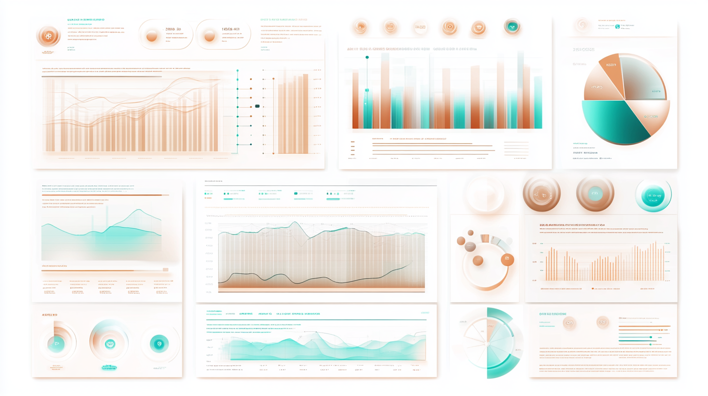

## Build Your Foundation: Professional, High-Impact Websites

### Create a Lasting First Impression Online

Every great digital journey begins with a strong online presence. At Tuba Tech Dynamics, we specialize in crafting professional, high-impact websites that make your organization’s mission clear, concise, and compelling. Your website sets the stage for deeper engagement and opens the door to future growth.

Our goal is to provide you with a beautifully designed, easy-to-navigate site that highlights your mission, key offerings, and contact information, making it easier for your audience to connect with you.

**Key Features**:
- **Clean, Professional Design**: A sleek and modern look that reflects your organization’s values.
- **Mobile-Friendly Layout**: Ensuring your site looks great on any device.
- **Scalable Structure**: Designed with growth in mind, so your site can expand as your needs evolve.

## Scale Up with Our Full Suite of Services

Once your initial site is live, we can help you expand with tailored services designed to grow alongside your organization’s needs:

### Custom Internal Applications

**Optimize Your Operations with Tailored Software Solutions**

Our custom internal applications streamline your processes, saving you time and resources. From workflow automation to data integration, we design software that fits seamlessly into your operations.

### Public Engagement Tools

**Boost Outreach with Interactive Tools for Your Audience**

Create meaningful connections with custom web tools, interactive maps, and online surveys. Our public engagement tools are designed to deepen your relationships and inspire community support.

### AI-Powered Solutions

**Harness the Power of AI to Elevate Your Mission**

From AI-enhanced grant writing to predictive data insights, our AI-powered solutions help you unlock new opportunities and make strategic decisions that move your mission forward.

### Intelligent Volunteer Management

**Streamline Volunteer Coordination with Smart Tools**

Managing volunteers can be challenging. Our intelligent tools automate scheduling, track hours, and match skills, making your volunteer program more efficient and effective.

## Ready to Make Your Tech Purr?

Start with a professional website or dive into our full suite of services to elevate your digital impact. Let’s make your tech purr with efficiency.

**[Contact us today](/contact) to get started.**
